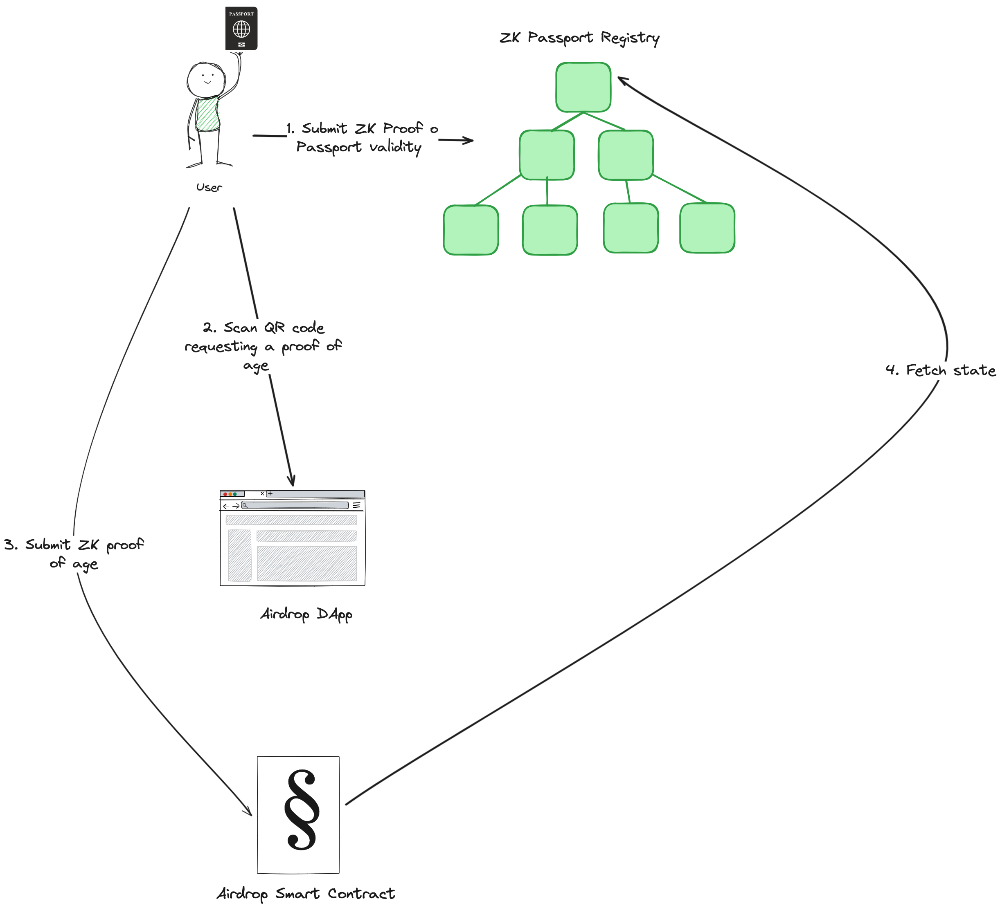

# ZK Registry Workshop #2: Building an age-restricted airdrop with ZK Passport Registry

## What are we trying to build

We want to build a simple airdrop DApp where only users over 18 years old can claim the token. We will use the ZK Passport Registry to verify the age of the users.

## Architecture

Key components:

- React front-end
- Node.js backend
- [Aidrop smart-contracts](https://github.com/rarimo/erc20-query-proof-contracts) that verify the age of the user and make sure a single user can only claim the tokens once using the ZK Passport Registry.
- RariMe App that allows users to scan their passport and prove their age using ZK Passport Registry. Download the app for [iOS](https://apps.apple.com/us/app/rarime/id123456789) or [Android](https://play.google.com/store/apps/details?id=com.rarime).





## Pre-requisites

1. **Install Node.js** (if not installed)
   Download and install from: [https://nodejs.org/](https://nodejs.org/)

1. **Install Yarn**
   Run one of the following commands:

   - Using Corepack (recommended for Node.js 16.10+):
     ```
     corepack enable
     ```
   - Using npm:
     ```
     npm install -g yarn
     ```
1. Follow instructions in [client](/client/README.md) and [server](/server/README.md) READMEs to set up the client and server.